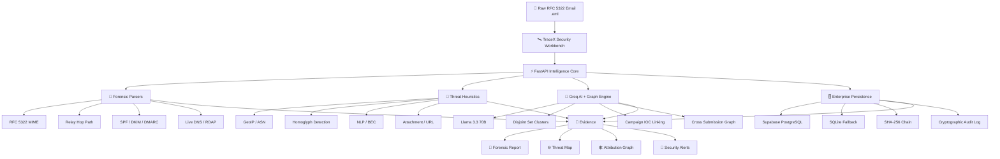
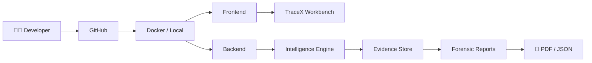

<div align="center">

# 🛰️ TraceX

### AI-Powered Email Threat Detection • GeoLocation • Forensic Intelligence


<br>


<br><br>


<br><br>

<a href="#-overview">Overview</a> • <a href="#-architecture">Architecture</a> • <a href="#-capabilities">Capabilities</a> • <a href="#-technology-stack">Tech Stack</a> • <a href="#-deployment">Deployment</a> • <a href="#-api-reference">API</a>

</div>

---

<div align="center">

## ⚡ TRACE • ANALYZE • CORRELATE • PROVE


</div>

## 🧾 Project Identity

<table>
<tr>
<td><b>SIH Problem Statement ID</b></td>
<td><code>26106</code></td>
</tr>
<tr>
<td><b>Organization</b></td>
<td>All India Council for Technical Education (AICTE) – Cyber Security Cell</td>
</tr>
<tr>
<td><b>Category</b></td>
<td>Software</td>
</tr>
<tr>
<td><b>Theme</b></td>
<td>Blockchain & Cybersecurity</td>
</tr>
</table>

---

# 🧠 Executive Overview

> **TraceX** is an enterprise-grade, court-admissible cyber forensics and Security triage intelligence platform engineered specifically for intelligence analysts, cybercrime cells, CERT teams, and enterprise incident response units.

TraceX operates under a:

```text
STRICT REAL-TIME / ZERO-HALLUCINATION EVIDENCE STANDARD
```

It ingests raw **RFC 5322 MIME messages (`.eml`)** and transforms them into structured forensic intelligence.

<div align="center">

```text
┌──────────────────────────────────────────────────────────────┐
│                         TRACE X                              │
├──────────────────────────────────────────────────────────────┤
│                                                              │
│  EMAIL → HEADERS → AUTHENTICATION → GEOLOCATION             │
│                         ↓                                    │
│             DOMAIN + NLP + URL INTELLIGENCE                  │
│                         ↓                                    │
│             AI GROUNDED EVIDENCE REASONING                   │
│                         ↓                                    │
│            CAMPAIGN / THREAT ACTOR CORRELATION               │
│                         ↓                                    │
│              FORENSIC REPORT + CHAIN OF CUSTODY             │
│                                                              │
└──────────────────────────────────────────────────────────────┘
```

</div>

TraceX decomposes headers, authenticates email cryptographic signatures (**SPF, DKIM, DMARC**), reconstructs relay hop timelines, geolocates originating sending nodes, identifies spoofing and typosquatting domains, evaluates NLP social engineering urgency vectors, scores malicious landing pages, reasons over telemetry with **Groq AI LPU acceleration**, and links disparate attacks into unified **Threat Actor Campaigns** using graph clustering and cryptographic chain-of-custody ledgers.

---

# 🛰️ Architecture

<div align="center">



</div>

<details>
<summary><b>🔍 View Detailed System Architecture</b></summary>

<br>

```text
                                   ┌──────────────────────────────────────────────┐
                                   │       TraceX Security Workbench              │
                                   │             React 19                         │
                                   │                                              │
                                   │ Telemetry │ Map │ Graph │ Case Desk │ PDF  │
                                   └───────────────────────┬──────────────────────┘
                                                           │
                                                           │ HTTP / REST
                                                           │ JWT Auth
                                                           ▼
                                   ┌──────────────────────────────────────────────┐
                                   │          FastAPI Intelligence Core            │
                                   │       Multi-Tenant / OpenAPI 3.1             │
                                   │                 Async IO                      │
                                   └───────────────┬──────────┬──────────┬─────────┘
                                                   │          │          │
                         ┌─────────────────────────┘          │          └──────────────────────┐
                         │                                    │                                 │
                         ▼                                    ▼                                 ▼
              ┌──────────────────┐                ┌──────────────────┐              ┌──────────────────┐
              │ Forensic Parsers │                │ Threat Heuristics│              │ Groq AI + Graph  │
              ├──────────────────┤                ├──────────────────┤              ├──────────────────┤
              │ RFC 5322 MIME    │                │ GeoIP / ASN      │              │ Llama 3.3 70B    │
              │ Relay Hop Trace  │                │ Homoglyph        │              │ Graph Clustering │
              │ SPF/DKIM/DMARC   │                │ NLP / BEC        │              │ IOC Correlation  │
              │ DNS / RDAP       │                │ URL / Attachment │              │ Campaign Linking │
              └────────┬─────────┘                └────────┬─────────┘              └────────┬─────────┘
                       │                                   │                                  │
                       └──────────────────────┬────────────┴──────────────────┬───────────────┘
                                              │                               │
                                              ▼                               ▼
                                   ┌──────────────────┐             ┌────────────────────────┐
                                   │ Evidence Engine  │             │ Enterprise Persistence │
                                   └────────┬─────────┘             ├────────────────────────┤
                                            │                       │ Supabase PostgreSQL    │
                                            │                       │ SQLite Local Fallback  │
                                            ▼                       │ SHA-256 Chain          │
                                   ┌──────────────────┐             │ Cryptographic Audit    │
                                   │ Forensic Reports │             └────────────────────────┘
                                   │ PDF + JSON       │
                                   └──────────────────┘
```

</details>

---

# 🛡️ Capabilities

## 1️⃣ Multi-Stage Threat Detection Engine

TraceX performs layered analysis rather than relying on a single detection mechanism.

<details>
<summary>🔬 Header Decomposition & Hop Timeline</summary>

Reconstructs the complete delivery chain (`Received:` headers) from originating client host (Hop 0) through intermediate mail transfers to the terminating gateway.

</details>

<details>
<summary>🔐 Protocol Verification</summary>

Validates SPF records via live DNS TXT queries, DKIM public key signatures, and DMARC alignment enforcement policies.

</details>

<details>
<summary>🌍 GeoLocation & ASN Infrastructure Tracker</summary>

Identifies physical geolocation:

```text
City
 ↓
Country
 ↓
Coordinates
 ↓
ISP
 ↓
ASN
 ↓
DNSBL Intelligence
```

Queries live Spamhaus/SpamCop DNSBL blacklists.

</details>

<details>
<summary>🎭 Domain Spoofing & Lookalike Engine</summary>

Detects:

* Homoglyph substitutions
* Cyrillic visual spoofing
* Bit-squatting
* Levenshtein edit distances
* Protected brand registry comparisons

</details>

<details>
<summary>🧠 NLP Social Engineering & BEC Classifier</summary>

Quantifies:

* Psychological coercion
* Executive impersonation vectors
* Financial wire instructions
* Credential urgency
* Business Email Compromise indicators

</details>

<details>
<summary>🔗 Defanged URL & Attachment Analyzer</summary>

Extracts embedded hyperlinks using defanging such as:

```text
hxxp[://]
```

Analyzes suspicious redirect chains and computes:

```text
SHA-256
```

file hashes.

</details>

<details>
<summary>🤖 Groq AI Grounded Reasoning</summary>

LPU-accelerated evidence reasoning separates:

```text
┌─────────────────────┐
│ OBSERVED FACTS      │
├─────────────────────┤
│ PROBABILISTIC       │
│ INFERENCES          │
├─────────────────────┤
│ UNKNOWN INFORMATION │
├─────────────────────┤
│ SECURITY ACTIONS    │
└─────────────────────┘
```

</details>

---

# 🕸️ 2️⃣ Attribution Graph & Incident Correlation

TraceX automatically correlates multi-submission threats through:

```text
Relay Subnets
      │
      ├─────────────┐
      ▼             ▼
Lookalike       Reply-To
Domains         Accounts
      │             │
      └──────┬──────┘
             ▼
      Payment Indicators
             │
             ▼
     Threat Campaign
```

The platform provides an **interactive campaign attribution visualization** allowing security analysts to track coordinated phishing clusters.

<div align="center">

```text
        🔴 ATTACK A
             │
             │ shared IOC
             ▼
        🟠 ATTACK B
             │
       ┌─────┴─────┐
       ▼           ▼
   DOMAIN IOC    ASN IOC
       │           │
       └─────┬─────┘
             ▼
      🟣 CAMPAIGN X
             │
       ┌─────┴─────┐
       ▼           ▼
   ATTACK C     ATTACK D
```

</div>

---

# ⚖️ 3️⃣ Court-Admissible Forensic Reporting

TraceX generates sealed, cryptographically signed:

```text
📄 PDF
📦 JSON
```

forensic investigation dossiers containing:

* RFC 5322 headers
* Technical findings
* Geolocation coordinates
* Chain-of-custody integrity hashes

<div align="center">

```text
Evidence
   │
   ▼
SHA-256 Hash
   │
   ▼
Immutable Chain
   │
   ▼
Cryptographic Audit
   │
   ▼
Signed Forensic Report
```

</div>

---

# 🖥️ 4️⃣ Enterprise Analyst Security Workbench

Built using **React + Vite**.

### ⚡ Command Dashboard

Provides:

* Live attack ingestion trends
* Severity distribution gauges
* Real-time alerts

### 📥 Threat Inbox

Comprehensive triage table with multi-factor filtering by:

```text
Risk
│
├── Critical
├── High
├── Medium
└── Low

Attack Taxonomy
│
├── Phishing
├── BEC
├── Spoofing
├── Malware
└── Credential Theft
```

### 🧪 7-Tab Forensic Workbench

<div align="center">

| Tab                        | Intelligence               |
| -------------------------- | -------------------------- |
| 🏠 Overview                | Investigation Summary      |
| 📡 Headers & Protocols     | RFC 5322 + Authentication  |
| 🌍 GeoLocation Map         | Origin Infrastructure      |
| 🧬 Domain Intel            | Spoofing / Domain Analysis |
| 🧠 AI / NLP Threat Signals | Social Engineering         |
| 🕸️ Attribution Graph      | Campaign Correlation       |
| 🔐 Chain of Custody        | Evidence Integrity         |

</div>

### 🌍 Interactive Global Map

Leaflet-powered geospatial threat radar.

### 📂 Case Management Desk

Correlates multiple message submissions into active forensic investigation cases.

---

# 🧩 Technology Stack

<table>
<tr>
<th>Layer</th>
<th>Technologies</th>
</tr>

<tr>
<td>🎨 Frontend</td>
<td>React 19, TypeScript, Vite, Tailwind CSS, Lucide Icons, Leaflet / React-Leaflet, Recharts</td>
</tr>

<tr>
<td>⚙️ Backend</td>
<td>Python 3.11+, FastAPI, Pydantic v2, SQLAlchemy 2.0 Async, Uvicorn</td>
</tr>

<tr>
<td>🗄️ Database</td>
<td>Supabase PostgreSQL 16 with SQLite / aiosqlite local fallback</td>
</tr>

<tr>
<td>🧠 ML / NLP</td>
<td>Scikit-Learn, Custom Heuristic NLP Engine, Homoglyph Matrix</td>
</tr>

<tr>
<td>🔬 Forensics</td>
<td>ReportLab PDF Generator, Hashlib (SHA-256 / SHA-512), dnspython</td>
</tr>

<tr>
<td>🚀 DevOps</td>
<td>Docker, Docker Compose, Nginx, Pytest, Pytest-Asyncio</td>
</tr>

</table>

---

# 🚀 Deployment

## 🐳 Option A — Docker Compose

<details open>
<summary><b>Recommended Deployment</b></summary>

### 1. Clone the repository

```bash
git clone https://github.com/Vignesh7778/AI-Powered-Email-Threat-Detection-GeoLocation-Forensic-Intelligence-Platform.git

cd "AI-Powered-Email-Threat-Detection-GeoLocation-Forensic-Intelligence-Platform"
```

### 2. Build and launch container stack

```bash
docker-compose up --build -d
```

### 3. Access Platform Services

```text
Frontend Security Platform
http://localhost:80

or

http://localhost:5173
```

```text
Backend OpenAPI / Swagger
http://localhost:8000/docs
```

</details>

---

# 💻 Option B — Local Development

<details>
<summary>⚙️ Backend Setup</summary>

```bash
cd backend

python -m venv venv
```

### Windows

```bash
venv\Scripts\activate
```

### Linux / macOS

```bash
source venv/bin/activate
```

### Install dependencies

```bash
pip install -r requirements.txt
```

### Seed synthetic test telemetry

```bash
python ../scripts/seed_demo_data.py
```

### Start FastAPI server

```bash
python -m uvicorn app.main:app --reload --port 8000
```

</details>

<details>
<summary>⚛️ Frontend Setup</summary>

```bash
cd frontend

npm install
```

### Start Vite development server

```bash
npm run dev
```

Open:

```text
http://localhost:5173
```

</details>

---

# 🧪 Automated Test Suite

TraceX includes a test suite covering:

```text
Headers
   ↓
DNS Authentication
   ↓
GeoIP
   ↓
Domain Homoglyphs
   ↓
NLP Threat Scoring
   ↓
Attachment Scanning
   ↓
Graph Correlation
   ↓
End-to-End API Pipeline
   ↓
PDF Generation
```

### Run the full test suite

```bash
python -m pytest backend/tests/test_all_modules.py -v
```

<div align="center">

### ✅ Test Result


<br>

```text
14 passed in ~16s
100% TEST PASS RATE
```

</div>

---

# 🔌 API Reference

<details>
<summary><b>🚀 Expand API Endpoints</b></summary>

<br>

| Method | Endpoint                           | Description                                             |
| ------ | ---------------------------------- | ------------------------------------------------------- |
| `POST` | `/api/v1/auth/login`               | JWT Authentication & Session Token                      |
| `POST` | `/api/v1/emails/ingest`            | Multipart upload for RFC 5322 `.eml` analysis           |
| `GET`  | `/api/v1/emails`                   | Paginated threat queue with search & filters            |
| `GET`  | `/api/v1/emails/{id}`              | Comprehensive forensic assessment details               |
| `GET`  | `/api/v1/dashboard/stats`          | Aggregate Security telemetry metrics & 24h attack trend |
| `GET`  | `/api/v1/alerts`                   | Real-time threat alerts feed                            |
| `POST` | `/api/v1/alerts/{id}/acknowledge`  | Mark security alert as reviewed                         |
| `GET`  | `/api/v1/cases`                    | Incident case management listings                       |
| `POST` | `/api/v1/cases`                    | Create and associate incident cases                     |
| `GET`  | `/api/v1/campaigns/{id}/graph`     | Cross-submission threat attribution graph               |
| `GET`  | `/api/v1/forensics/chain/{id}`     | Cryptographic chain-of-custody audit log                |
| `GET`  | `/api/v1/reports/{id}?format=pdf`  | Court-admissible forensic PDF export                    |
| `GET`  | `/api/v1/reports/{id}?format=json` | Raw forensic JSON telemetry export                      |

</details>

---

# 📧 Synthetic Sample Datasets

TraceX provides synthetic, privacy-safe RFC 5322 `.eml` sample test emails.

<details>
<summary>🧪 Expand Sample Dataset</summary>

<br>

| Dataset                  | Scenario                                                 |
| ------------------------ | -------------------------------------------------------- |
| `phishing.eml`           | Credential harvesting with obfuscated lookalike link     |
| `bec.eml`                | Executive wire fraud payment diversion attempt           |
| `impersonation.eml`      | Brand domain visual spoofing attack                      |
| `suspicious.eml`         | Message originating through TOR exit node infrastructure |
| `clean.eml`              | Valid enterprise communication with SPF/DKIM/DMARC pass  |
| `attachment_malware.eml` | Disallowed high-risk executable script payload           |

</details>

---

# 🔄 TraceX Investigation Pipeline

```mermaid
flowchart LR

    A["📧 EMAIL"] --> B["📥 INGEST"]
    B --> C["🔬 PARSE"]
    C --> D["🔐 AUTHENTICATE"]
    D --> E["🌍 GEOLOCATE"]
    E --> F["🎭 SPOOF DETECTION"]
    F --> G["🧠 NLP ANALYSIS"]
    G --> H["🔗 IOC CORRELATION"]
    H --> I["🕸️ CAMPAIGN GRAPH"]
    I --> J["🤖 AI REASONING"]
    J --> K["🔐 CHAIN OF CUSTODY"]
    K --> L["📄 FORENSIC REPORT"]

    style A stroke-width:2px
    style L stroke-width:3px
```

<div align="center">



</div>

---

# 🎯 What TraceX Answers

<div align="center">

| Question                              | TraceX Intelligence          |
| ------------------------------------- | ---------------------------- |
| 📩 Who sent the email?                | Relay / Header Analysis      |
| 🌍 Where did it originate?            | GeoIP + ASN                  |
| 🔐 Was authentication valid?          | SPF / DKIM / DMARC           |
| 🎭 Was the domain spoofed?            | Homoglyph / Lookalike Engine |
| 🧠 Is it social engineering?          | NLP Threat Signals           |
| 🔗 Is the URL malicious?              | URL / Redirect Analysis      |
| 🧬 Is this related to another attack? | Attribution Graph            |
| 👥 Is there a campaign?               | Campaign Correlation         |
| ⚖️ Can evidence be preserved?         | Chain of Custody             |
| 📄 Can investigators export evidence? | PDF / JSON Forensics         |

</div>

---

# 🏢 Intended Users

```text
                 ┌─────────────────────┐
                 │       TraceX        │
                 └──────────┬──────────┘
                            │
        ┌───────────────────┼───────────────────┐
        ▼                   ▼                   ▼
┌───────────────┐   ┌───────────────┐   ┌────────────────┐
│ Intelligence  │   │ Cybercrime    │   │ CERT / CSIRT   │
│ Analysts      │   │ Cells         │   │ Teams          │
└───────────────┘   └───────────────┘   └────────────────┘
        │                   │                   │
        └───────────────────┼───────────────────┘
                            ▼
                  ┌───────────────────┐
                  │ Enterprise IR     │
                  │ Security Teams    │
                  └───────────────────┘
```

---

# 🔐 Evidence Philosophy

<div align="center">

### FACT → INFERENCE → UNKNOWN → ACTION

</div>

TraceX is designed around evidence-grounded analysis.

```text
┌───────────────────────────────────────────────┐
│                  OBSERVED                     │
│                                               │
│ Directly extracted evidence from the email    │
└──────────────────────┬────────────────────────┘
                       ▼
┌───────────────────────────────────────────────┐
│                INFERENCE                      │
│                                               │
│ Reasoned conclusions supported by evidence     │
└──────────────────────┬────────────────────────┘
                       ▼
┌───────────────────────────────────────────────┐
│                  UNKNOWN                      │
│                                               │
│ Information that cannot be established        │
└──────────────────────┬────────────────────────┘
                       ▼
┌───────────────────────────────────────────────┐
│                 ACTION                        │
│                                               │
│ Security response / investigation steps       │
└───────────────────────────────────────────────┘
```

---

# ⛓️ Chain of Custody

<div align="center">

```text
RAW EMAIL
   │
   ▼
HASH
   │
   ▼
ANALYSIS
   │
   ▼
EVIDENCE
   │
   ▼
SHA-256 CHAIN
   │
   ▼
AUDIT LOG
   │
   ▼
FORENSIC REPORT
```

</div>

Cryptographic integrity is maintained using SHA-256 chain-of-custody mechanisms and cryptographic audit logging.

---

# 🌐 Security Workbench

<div align="center">

```text
╔══════════════════════════════════════════════════════════════╗
║                     TRACEX WORKBENCH                        ║
╠══════════════════════════════════════════════════════════════╣
║                                                              ║
║  🚨 ALERTS       📊 TELEMETRY       🌍 GLOBAL THREATS       ║
║                                                              ║
║  ──────────────────────────────────────────────────────────  ║
║                                                              ║
║  📥 THREAT INBOX                                             ║
║                                                              ║
║  Critical   High   Medium   Low                              ║
║                                                              ║
║  ──────────────────────────────────────────────────────────  ║
║                                                              ║
║  🧪 FORENSIC WORKBENCH                                       ║
║                                                              ║
║  Overview │ Headers │ Geo │ Domain │ AI │ Graph │ Custody   ║
║                                                              ║
╚══════════════════════════════════════════════════════════════╝
```

</div>

---

# 🧬 End-to-End Intelligence

<div align="center">


</div>

---

# 📊 TraceX at a Glance

<div align="center">

| Capability                   | Status |
| ---------------------------- | ------ |
| 📧 RFC 5322 Email Parsing    | ✅      |
| 🔐 SPF Verification          | ✅      |
| 🔑 DKIM Verification         | ✅      |
| 🛡️ DMARC Analysis           | ✅      |
| 🌍 GeoIP / ASN Intelligence  | ✅      |
| 🎭 Domain Spoofing Detection | ✅      |
| 🧠 NLP Threat Analysis       | ✅      |
| 🔗 URL / Attachment Analysis | ✅      |
| 🤖 AI Grounded Reasoning     | ✅      |
| 🕸️ Campaign Attribution     | ✅      |
| 🌐 Interactive Threat Map    | ✅      |
| 📂 Case Management           | ✅      |
| 🔐 Chain of Custody          | ✅      |
| 📄 PDF Forensic Reports      | ✅      |
| 📦 JSON Evidence Export      | ✅      |
| 🧪 Automated Tests           | ✅      |

</div>

---

# 🛠️ Development Workflow



---

# 📁 Project Structure

```text
TraceX/
│
├── backend/
│   ├── app/
│   ├── tests/
│   └── requirements.txt
│
├── frontend/
│   ├── src/
│   ├── components/
│   └── package.json
│
├── datasets/
│   └── sample_emails/
│       ├── phishing.eml
│       ├── bec.eml
│       ├── impersonation.eml
│       ├── suspicious.eml
│       ├── clean.eml
│       └── attachment_malware.eml
│
├── scripts/
│   └── seed_demo_data.py
│
├── docker-compose.yml
└── README.md
```

---

# 🔗 API → Intelligence Flow

```text
POST /api/v1/auth/login
             │
             ▼
POST /api/v1/emails/ingest
             │
             ▼
GET /api/v1/emails
             │
             ▼
GET /api/v1/emails/{id}
             │
      ┌──────┴──────┐
      ▼             ▼
GET /alerts     GET /cases
      │             │
      └──────┬──────┘
             ▼
GET /campaigns/{id}/graph
             │
             ▼
GET /forensics/chain/{id}
             │
             ▼
GET /reports/{id}
             │
      ┌──────┴──────┐
      ▼             ▼
    PDF           JSON
```

---

# ⚖️ License & Compliance

Developed for:

**Problem Statement 26106 — AICTE Cyber Security Cell**

Licensed under the **Apache 2.0 License**.

---

<div align="center">

# 🛰️ TRACE THE SIGNAL. EXPOSE THE THREAT. PRESERVE THE EVIDENCE.


### TraceX

**AI-Powered Email Threat Detection • GeoLocation • Forensic Intelligence**

<br>


</div>
