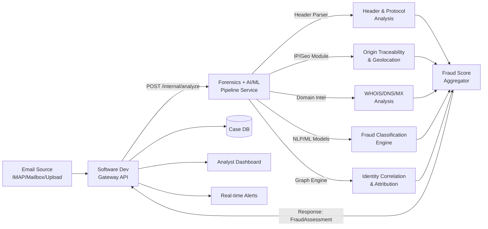

# AI-Powered Email Threat Detection, GeoLocation & Forensic Intelligence Platform

**Organization:** AICTE — Cyber Security Cell
**Category:** Software | **Theme:** Blockchain & Cybersecurity

This repo is split across three teams. This document is the map — read it first, then go to your team's doc.

| Team | Doc | Owns |
|---|---|---|
| Software Development | [`software-dev-README.md`](./software-dev-README.md) | Gateway API, auth, DB, case management, dashboard, alerting |
| Cyber Forensics | [`forensics-README.md`](./forensics-README.md) | Header/protocol analysis, origin tracing, geolocation, infra flags, domain intelligence, chain-of-custody |
| AI/ML | [`aiml-README.md`](./aiml-README.md) | NLP/link/classifier models, attachment scoring, graph correlation & attribution, score aggregation |

Forensics and AI/ML are two separate services/teams, but they form one pipeline: Forensics extracts signals first, AI/ML consumes them as classifier features. See `forensics-README.md` §5 and `aiml-README.md` §0 for the exact handoff schema between them.

---

## How to Reference Across Docs

Each team owns and edits only their own doc. When your work depends on another team's endpoint or data shape, **don't copy their spec into your doc** — link to it. This keeps every contract defined in exactly one place, so it can't drift out of sync.

**Reference format:** `` `<doc-file>` §<section-number> `` — e.g. `forensics-README.md §2` or `README.md §2.2`.

Use it two ways:
- **Inline in prose**, when explaining why you're calling something: *"originating IP comes from `forensics-README.md §2`."*
- **As a markdown link**, when the reader will likely click through: `` [`forensics-README.md §2`](./forensics-README.md#2-origin-traceability--geolocation) ``

### Who references whom

| Your team | Your doc | Reference this doc when... | Section to point to |
|---|---|---|---|
| Software Development | `software-dev-README.md` | Calling the pipeline, or building the ingestion/report endpoints | `README.md` §2.1 (`EmailSubmission`), §2.2 (`FraudAssessment`), §3 (sync/async) |
| Cyber Forensics | `forensics-README.md` | Confirming what AI/ML expects to receive from you | `aiml-README.md` §0 (input contract) |
| AI/ML | `aiml-README.md` | Confirming what Forensics provides as input | `forensics-README.md` §5 (output contract table) |
| Any team | any doc | Confirming the final response shape sent back to Gateway | `README.md` §2.2 (`FraudAssessment`) |

### Rules

1. **Link to a section, not a paragraph.** Endpoints move within a doc; sections are the stable unit. If you need to be more specific, name the endpoint too: `forensics-README.md §2 (POST /forensics/geo/lookup)`.
2. **Never restate another team's schema.** If you need a field from their contract, reference it (`per aiml-README.md §0, features.lookalike_score`) instead of pasting their JSON — a pasted copy will eventually disagree with the source.
3. **Raising a mismatch:** if what you need isn't in the other team's doc, or their contract doesn't match what you're actually receiving, flag it against the *shared* contract first (`README.md` §2), not by unilaterally changing your assumption — §2 is the one section all three teams must agree on together.
4. **Numbering must stay stable.** If you reorder your own doc's sections, update every other doc's references to it — search for your doc's filename across the repo before renumbering.

---

## 1. System Architecture



**Flow in words:**
1. Software Dev's Gateway ingests a raw email (via upload, IMAP pull, or forwarded mailbox) and stores the raw artifact + metadata.
2. Gateway calls the combined Forensics+AI/ML service with the raw email (headers + body + attachments metadata).
3. The Forensics+AI/ML service runs all five analysis modules in parallel where possible, aggregates them into a single `FraudAssessment` object, and returns it synchronously (or async via webhook for large attachments — see §3).
4. Gateway persists the assessment, triggers alerts if `fraud_score` crosses threshold, and updates the dashboard/case view.

---

## 2. Shared Data Contracts

These objects are the "wire format" between Software Dev and Forensics+AI/ML. Both teams must agree on these schemas before building — treat this section as the source of truth; **only update it together**.

### 2.1 `EmailSubmission` (Gateway → Pipeline)

```json
{
  "submission_id": "uuid",
  "received_at": "2026-08-26T10:15:00Z",
  "raw_headers": "string (full raw header block, unmodified)",
  "raw_body": {
    "text_plain": "string|null",
    "text_html": "string|null"
  },
  "attachments": [
    {
      "filename": "invoice.pdf",
      "content_type": "application/pdf",
      "sha256": "hex string",
      "size_bytes": 24576,
      "storage_ref": "internal blob URI, not the raw bytes"
    }
  ],
  "source_context": {
    "ingested_via": "imap|upload|forward|api",
    "tenant_id": "uuid",
    "mailbox": "string|null"
  }
}
```

> Note: attachments are passed by reference (`storage_ref`), not inline — the pipeline service pulls bytes only if a module needs them (e.g. malware/link extraction), keeping payloads small and avoiding duplicating evidence storage.

### 2.2 `FraudAssessment` (Pipeline → Gateway)

```json
{
  "submission_id": "uuid",
  "analyzed_at": "2026-08-26T10:15:04Z",
  "fraud_score": 0.87,
  "risk_level": "low|medium|high|critical",
  "classification": "legitimate|suspicious|impersonation|phishing|bec_fraud",
  "confidence": 0.91,
  "auth_results": {
    "spf": "pass|fail|softfail|none",
    "dkim": "pass|fail|none",
    "dmarc": "pass|fail|none",
    "alignment_ok": true
  },
  "origin": {
    "originating_ip": "203.0.113.42",
    "geolocation": {
      "country": "string",
      "region": "string",
      "city": "string",
      "isp": "string",
      "hosting_provider": "string|null",
      "lat": 0.0,
      "lon": 0.0
    },
    "infra_flags": ["vpn", "tor", "open_relay", "cloud_hosted", "botnet_suspected"]
  },
  "relay_path": [
    {"hop": 0, "ip": "203.0.113.42", "hostname": "string|null", "timestamp": "ISO8601"},
    {"hop": 1, "ip": "198.51.100.7", "hostname": "string|null", "timestamp": "ISO8601"}
  ],
  "domain_intel": {
    "sender_domain": "example.com",
    "domain_age_days": 4,
    "registrar": "string",
    "mx_records": ["mx1.example.com"],
    "lookalike_of": "paypal.com|null",
    "lookalike_score": 0.93
  },
  "indicators": [
    {"type": "urgency_language", "detail": "string", "weight": 0.2},
    {"type": "spoofed_display_name", "detail": "string", "weight": 0.3},
    {"type": "malicious_link", "detail": "string", "weight": 0.4}
  ],
  "attribution": {
    "linked_campaign_id": "uuid|null",
    "related_submission_ids": ["uuid"],
    "cluster_confidence": 0.65
  },
  "processing_mode": "sync|async",
  "webhook_status": "not_applicable|pending|delivered"
}
```

### 2.3 Error contract (both directions)

```json
{
  "error_code": "STRING_CODE",
  "message": "human readable",
  "submission_id": "uuid|null",
  "retryable": true
}
```

---

## 3. Sync vs Async

- **Sync path** (default): header/IP/domain/NLP analysis, typically < 3s → Gateway calls pipeline and waits.
- **Async path**: triggered when attachments need deep scanning or graph correlation needs a wider lookback. Pipeline immediately returns `202` with `submission_id`, then POSTs the final `FraudAssessment` to a webhook Gateway registers at `/internal/webhooks/fraud-assessment`.

Each team's doc has the exact endpoint contracts for this.

---

## 4. Privacy & Evidence Handling (applies to both teams)

- Raw email content and PII are never logged in plaintext application logs — only `submission_id` and hashes.
- Evidence (raw headers, raw body, attachment hashes) must be stored with a chain-of-custody record: who/what accessed it and when.
- Retention and masking rules are configurable per tenant — see each team's doc for the specific config endpoints.
